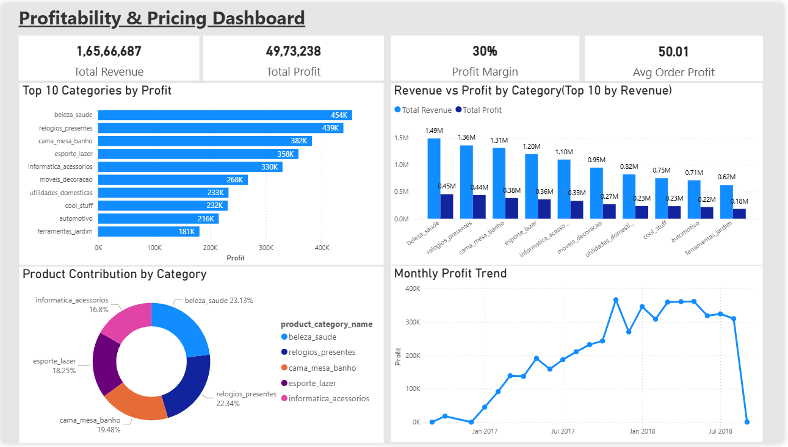
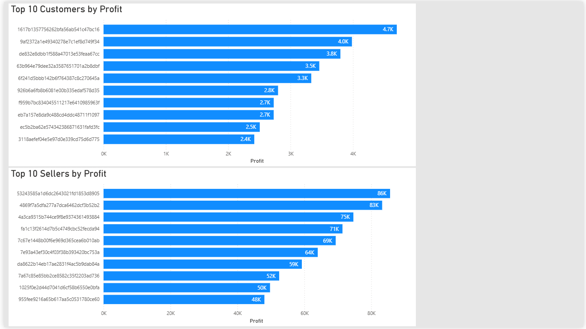

Dynamic Pricing & Profitability Analysis System

Project Overview:

This project analyzes an e-commerce dataset to identify profit drivers, pricing inefficiencies, and customer-level performance. It also includes an interactive tool to simulate pricing strategies and evaluate their impact on profitability.
The project combines data analysis, visualization, and decision modeling to support data-driven business decisions.
________________________________________
Problem Statement:

Businesses often face challenges in understanding:

•	Which products or categories generate the most profit

•	Whether current pricing strategies are optimal 

•	How pricing changes impact overall profitability

This project addresses these challenges by building a profitability analysis framework along with a pricing simulation tool.
________________________________________
Tools and Technologies:

•	Python (Pandas) for data analysis and feature engineering 

•	Power BI for interactive dashboard visualization 

•	Streamlit for building a web-based pricing simulation tool 
________________________________________
Key Features:

•	Profitability analysis across product categories, customers, and sellers 

•	Identification of high-performing and underperforming segments 

•	Pricing simulation engine to model price changes (±5–20%) 

•	Recommendation logic to support pricing decisions 

•	Interactive Streamlit application for real-time simulation 
________________________________________
Dashboard Preview:

________________________________________
How to Run the Project:

1. Clone the repository

git clone https://github.com/wbanerjee/dynamic-pricing-analysis

cd dynamic-pricing-analysis

2. Install dependencies

pip install -r requirements.txt

3. Extract Dataset

The dataset is provided as a compressed ZIP file due to size limitations.
Please extract it inside the Data/ folder before running the project.

4. Run the Streamlit Application

cd src
streamlit run app.py
________________________________________
Key Insights:

•	Profit is concentrated in a limited number of product categories, indicating dependency risk 

•	Some segments contribute minimal profit, suggesting pricing inefficiencies 

•	Simulated price adjustments indicate potential improvement in profitability of approximately 5% 
________________________________________
Project Highlights:

•	Built an end-to-end system integrating analysis, visualization, and simulation 

•	Structured with a consulting-oriented approach focused on business decision-making 

•	Enables users to evaluate pricing strategies interactively 
________________________________________
Note:

The dataset is included as a compressed file due to size constraints.
The full dataset was used during development and analysis.

